# github-profile-widget

A self-updating GitHub profile widget that shows what you've shipped and what you've landed upstream — refreshed daily by GitHub Actions.

<a href="https://github.com/LukeTheoJohnson?tab=repositories">

</a>

**Left column** — your non-fork public repos, sorted by recent activity, each with language, star count, and a 14-day commit heatmap.

**Right column** — your merged pull requests grouped by upstream project over the last year, plus a 12-month cadence sparkline.

**Header** — a generated "key insight" caption highlighting your highest-impact open-source contributions.

Private repos are never included — merged-PR data is explicitly scoped to public repositories (`is:public`), so a local token and the Actions token produce identical output.

---

## Setup

**1. Fork this repo.**

Your GitHub username is detected automatically from the Actions environment — no code edits needed. Enable Actions on the fork if prompted (Settings → Actions → Allow all actions).

**2. Set your display name and tagline** under Settings → Secrets and variables → Actions → **Variables** (not Secrets):

| Variable | Default | Description |
|---|---|---|
| `WIDGET_NAME` | your GitHub username | Display name in the header |
| `WIDGET_TAGLINE` | *(none)* | Short tagline top-right, e.g. `OPEN SOURCE · PYTHON · ML` |
| `WIDGET_PROJECT_LIMIT` | `6` | Max own-project cards on the left |
| `WIDGET_BAR_LIMIT` | `6` | Max merged-PR repo bars on the right |
| `WIDGET_CORE_STARS` | `10000` | Star threshold for the key-insight caption to call a project "core" |

**3. Trigger the first run** manually: Actions → profile-widget → Run workflow. The widget generates immediately and commits `assets/widget.svg`. After that it refreshes daily at 06:17 UTC.

**4. Embed it** in your profile README (`YOUR_USERNAME/YOUR_USERNAME`):

```markdown
<a href="https://github.com/YOUR_USERNAME?tab=repositories">

</a>
```

---

## How it works

- Zero dependencies — pure Python standard library (`urllib`, `json`, `pathlib`)
- No API keys or secrets required — uses the built-in `GITHUB_TOKEN` provided by Actions
- Generates a single self-contained SVG with CSS entrance animations gated behind `prefers-reduced-motion`
- The workflow handles push races (another commit landing between checkout and push) with a fetch-reset-retry loop
